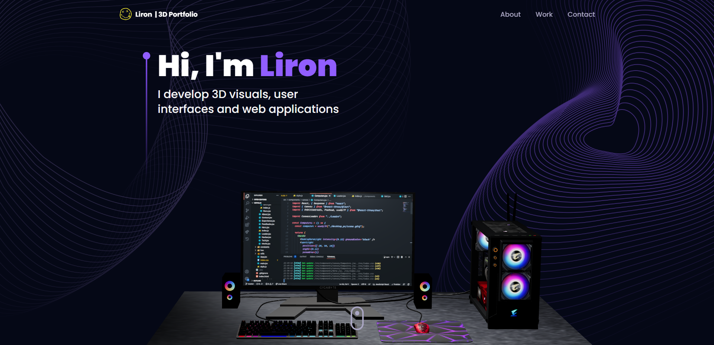

# 3D Portfolio

<!-- GitHub badges -->

[](https://github.com/ladunjexa/reactjs18-3d-portfolio/releases/tag/v0.1.0)
[](https://github.com/ladunjexa/reactjs18-3d-portfolio/stargazers)
[](https://github.com/ladunjexa/reactjs18-3d-portfolio/forks)
[](https://github.com/ladunjexa/reactjs18-3d-portfolio/commits)
[](https://github.com/ladunjexa/reactjs18-3d-portfolio/pulls)



[](https://github.com/luadnjexa)
[](https://github.com/ladunjexa/reactjs18-3d-portfolio/blob/main/LICENSE)
[](https://www.typescriptlang.org/)
[](https://github.com/ladunjexa/reactjs18-3d-portfolio/graphs/contributors)


[](https://snyk.io/test/github/ladunjexa/reactjs18-3d-portfolio)

## 🌐 Live Demo

Explore the live demonstration of the project:
[reactjs18-3d-portfolio](https://reactjs18-3-d-portfolio.vercel.app/)

## 📝 Description

**3D Portfolio** is a well-designed and fully functional portfolio website that is built with
React.js and Three.js. It is a fully responsive website that works well on all devices.

<details><summary><b>Folder Structure</b></summary>

```bash
reactjs18-3d-portfolio/
├── src/
├   ├── App.tsx
├   ├── globals.css
├   ├── main.tsx
├   ├── vite.env.d.ts
├   ├── components/
├   ├   ├── atoms/
├   ├   ├   └── Header.tsx
├   ├   ├── canvas/
├   ├   ├   ├── Ball.tsx
├   ├   ├   ├── Computers.tsx
├   ├   ├   ├── Earth.tsx
├   ├   ├   ├── Stars.tsx
├   ├   ├   └── index.ts
├   ├   ├── layout/
├   ├   ├   ├── Loader.tsx
├   ├   ├   └── Navbar.tsx
├   ├   ├── sections/
├   ├   ├   ├── About.tsx
├   ├   ├   ├── Contact.tsx
├   ├   ├   ├── Experience.tsx
├   ├   ├   ├── Feedbacks.tsx
├   ├   ├   ├── Hero.tsx
├   ├   ├   ├── Tech.tsx
├   ├   ├   ├── Works.tsx
├   ├   ├   └── page.tsx
├   ├   └── index.ts
├   ├── constants/
├   ├   ├── config.ts
├   ├   ├── styles.ts
├   ├   └── index.ts
├   ├── hoc/
├   ├   ├── SectionWrapper.tsx
├   ├   └── index.ts
├   ├── utils/
├   ├   └── motion.ts
├   ├── types/
├   ├   └── index.d.ts
├   └── assets/
├       ├── company/
├       ├   └── [[...]].{svg,png}
├       ├── tech/
├       ├   └── [[...]].{svg,png}
├       ├── [[...]].{svg,png}
├       └── index.ts
├── public/
├   ├── desktop_pc
├   ├   ├── textures/[[...]].png
├   ├   ├── license.txt
├   ├   ├── scene.bin
├   ├   └── scene.gltf
├   ├── planet
├   ├   ├── textures/[[...]].png
├   ├   ├── license.txt
├   ├   ├── scene.bin
├   ├   └── scene.gltf
├   ├── logo.png
├   └── logo.svg
├── .env
├── .eslintignore
├── .eslintrc.cjs
├── .gitignore
├── .prettierignore
├── .prettierrc.cjs
├── index.html
├── LICENSE
├── README.md
├── package.json
├── postcss.config.cjs
├── tailwind.config.cjs
├── tsconfig.json
├── tsconfig.node.json
└── vite.config.js
```

</details>

## 📖 Table of Contents

<details><summary>Table of Contents</summary>

- [Live Demo](#-live-demo)
- [Description](#-description)
- [Technologies Used](#-technologies-used)
- [Get Started](#-get-started)
  - [Prerequisites](#-prerequisites)
  - [Installation and Run Locally](#-installation-and-run-locally)
  - [Scripts](#-scripts)
- [Environment Variables](#-environment-variables)
- [Deployment](#-deployment)
  - [Deploy to production (manual)](#-deploy-to-production-manual)
  - [Deploy on Vercel (recommended)](#-deploy-on-vercel-recommended)
  - [Deploy on Netlify](#-deploy-on-netlify)
- [Contributing](#-contributing)
  - [Bug / Feature Request](#-bug--feature-request)
- [Acknowledgements](#-acknowledgements)
- [References](#-references)
- [Contact Us](#-contact-us)
- [License](#-license)

</details>

## ✨ Technologies Used

<details><summary><b>3D Portfolio</b> is built using the following technologies:</summary>

- [TypeScript](https://www.typescriptlang.org/): TypeScript is a typed superset of JavaScript that
  compiles to plain JavaScript.
- [Vite](https://vitejs.dev/): Vite is a build tool that aims to provide a faster and leaner
  development experience for modern web projects.
- [React.js](https://reactjs.org/): React is a free and open-source front-end JavaScript library for
  building user interfaces or UI components.
- [Three.js](https://threejs.org/): Three.js is a cross-browser JavaScript library and application
  programming interface used to create and display animated 3D computer graphics in a web browser
  using WebGL.
- [Framer Motion](https://www.framer.com/motion/): Framer Motion is a production-ready motion
  library for React.
- [Tailwind CSS](https://tailwindcss.com/): Tailwind CSS is a utility-first CSS framework for
  rapidly building custom user interfaces.
- [ESLint](https://eslint.org/): ESLint is a static code analysis tool for identifying problematic
  patterns found in JavaScript code.
- [Prettier](https://prettier.io/): Prettier is an opinionated code formatter.
- [Vercel](https://vercel.com/): Vercel is a cloud platform for frontend developers, providing the
  frameworks, workflows, and infrastructure to build a faster, more personalized Web.

</details><br/>

[](https://skillicons.dev)

## 🧰 Get Started

To get this project up and running in your development environment, follow these step-by-step
instructions.

### 📋 Prerequisites

In order to install and run this project locally, you would need to have the following installed on
your local machine.

- [Node.js](https://nodejs.org/en/)
- [NPM](https://www.npmjs.com/get-npm)
- [Git](https://git-scm.com/downloads)

### ⚙️ Installation and Run Locally

**Step 0:**

Note :bangbang: the application uses EmailJS in order to send emails using client-side, therefore,
you need to create EmailJS account [here](https://emailjs.com/) and sets the
`VITE_EMAILJS_SERVICE_ID`, `VITE_EMAILJS_TEMPLATE_ID`, and `VITE_EMAIL_JS_ACCESS_TOKEN` environment
variables in `.env` file.

**Step 1:**

Download or clone this repo by using the link below:

```bash
git clone https://github.com/ladunjexa/reactjs18-3d-portfolio.git
```

**Step 2:**

Execute the following command in the root directory of the downloaded repo in order to install
dependencies:

```bash
npm install
```

**Step 3:**

Execute the following command in order to run the development server locally:

```bash
npm run dev
```

**Step 4:**

Open [http://localhost:5173](http://localhost:5173) with your browser to see the result.

### 📜 Scripts

All scripts are defined in the `package.json` file. Here is a list of all scripts:

| Script             | Action                                      |
| :----------------- | :------------------------------------------ |
| `npm install`      | Installs dependencies                       |
| `npm run dev`      | Starts local dev server at `localhost:5137` |
| `npm run build`    | Build your production site to `./dist/`     |
| `npm run preview`  | Boot up a local static web server           |
| `npm run lint`     | Run ESLint                                  |
| `npm run ts:check` | Perform type-checking                       |

## 🔒 Environment Variables

Environment variables[^3] can be used for configuration. They must be set before running the app.

> [Environment variables](https://en.wikipedia.org/wiki/Environment_variable) are variables that are
> set in the operating system or shell, typically used to configure programs.

**React.js 18 3D Portfolio** uses [EmailJS](https://www.emailjs.com/) as external service. You need
to create an account and get the required credentials to run the app.

Create a `.env` file in the root directory of the project and add the following environment
variables:

```env
VITE_EMAILJS_SERVICE_ID=<VITE_EMAILJS_SERVICE_ID>
VITE_EMAILJS_TEMPLATE_ID=<VITE_EMAILJS_TEMPLATE_ID>
VITE_EMAIL_JS_ACCESS_TOKEN=<VITE_EMAIL_JS_ACCESS_TOKEN>
```

## 🚀 Deployment

#### Deploy to production (manual)

You can create an optimized production build with the following command:

```bash
npm run build
```

#### Deploy on Vercel (recommended)

The easiest way to deploy this Next.js app is to use the
[Vercel Platform](https://vercel.com/new?utm_medium=default-template&filter=next.js&utm_source=create-next-app&utm_campaign=create-next-app-readme).

[](https://vercel.com/new/clone?repository-url=https%3A%2F%2Fgithub.com%2Fladunjexa%2Freactjs18-3d-portfolio)

#### Deploy on Netlify

You can also deploy this Next.js app with [Netlify](https://www.netlify.com/).

[](https://app.netlify.com/start/deploy?repository=https://github.com/ladunjexa/reactjs18-3d-portfolio)

Check out [Next.js deployment documentation](https://nextjs.org/docs/deployment) for more details.

## 🔧 Contributing

[](https://github.com/ladunjexa/reactjs18-3d-portfolio/graphs/contributors)

Contributions are what make the open source community such an amazing place to learn, inspire, and
create. Any contributions you make are **greatly appreciated**.

To fix a bug or enhance an existing module, follow these steps:

1. Fork the repo
2. Create a new branch (`git checkout -b improve-feature`)
3. Make the appropriate changes in the files
4. Commit your changes (`git commit -am 'Improve feature'`)
5. Push to the branch (`git push origin improve-feature`)
6. Create a Pull Request 🎉

### 📩 Bug / Feature Request

If you find a bug (failure of a module to execute its intended function), kindly open an issue
[here](https://github.com/ladunjexa/reactjs18-3d-portfolio/issues/new) by including the issue with a
title and clear description.

If you'd like to request a new function, feel free to do so by opening an issue
[here](https://github.com/ladunjexa/reactjs18-3d-portfolio/issues/new). Please include sample
queries and their corresponding results.

## 💎 Acknowledgements

I'd like to express my gratitude to the following people who helped me with this project and made it
possible:

- [Tailwind CSS](https://tailwindcss.com/)
- [Three.js](https://threejs.org/)
- [Framer Motion](https://www.framer.com/motion/)
- [React Vertical Timeline Component](https://www.npmjs.com/package/react-vertical-timeline-component)
- [React Parallax Tilt](https://www.npmjs.com/package/react-parallax-tilt)
- [Maath](https://www.npmjs.com/package/maath)
- [EmailJS](https://www.emailjs.com/)
- [ESLint](https://eslint.org/)
- [Prettier](https://prettier.io/)
- [Vercel](https://vercel.com/)
- [JavaScript Mastery](https://www.jsmastery.pro/)

## 📞 Contact Us

[](https://t.me/ladunjexa)
[](https://www.linkedin.com/in/lironabutbul)
[](https://www.instagram.com/ladunjexa)
[](https://discord.com/users/827996364331810816)

<!-- [](https://twitter.com/intent/follow?screen_name=ladunjexa) -->

## 📋 License

**Three.js 3D Portfolio** is open source software
[licensed as MIT](https://opensource.org/license/mit/) and is free to use — See
[LICENSE](https://github.com/ladunjexa/reactjs18-3d-portfolio/blob/main/LICENSE) for more details.
