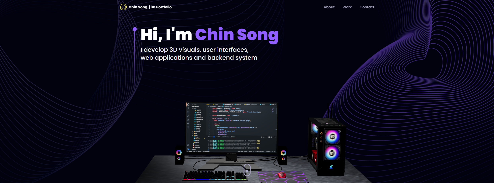

<a name="readme-top"></a>
<div align="center">


  <h1>Three.js 3D Portfolio</h1>
  
  <p>
    Three.js 3D Portfolio is a modern UI/UX and functional Developer Portfolio Web built with React & Three.js
  </p>
   
 <h4>
    <a href="https://jsonggan.github.io/Threejs-3D-Portfolio/">View Demo</a>
  </h4>
</div>

<br />

<!-- Table of Contents -->
<details>

<summary>

# Table of Contents

</summary>

- [About the Project](#star2-about-the-project)
  * [Folder Structure](#bangbang-folder-structure)
  * [Tech Stack](#space_invader-tech-stack)
- [Getting Started](#toolbox-getting-started)
  * [Installation](#gear-installation)
  * [Run Locally](#running-run-locally)
- [Contributing](#wave-contributing)
- [License](#warning-license)
- [Contact](#handshake-contact)
- [Acknowledgements](#gem-acknowledgements)

</details>  

<!-- About the Project -->
## About the Project

<div align="center">
  
</div>

<br />

This repository houses an well-designed and functional Developer Portfolio Website consisting Navbar, Hero, Overview, Work Experience, Technologies, Projects, Testimonials and Contact sections built with React & Three.js using TailwindCSS ⏭

<!-- TechStack -->
### Tech Stack

[](https://skillicons.dev)

<p align="right">(<a href="#readme-top">back to top</a>)</p>

<!-- Getting Started -->
## Getting Started

<!-- Installation -->
### Installation

#### Step 1:
Download or clone this repo by using the link below:

```bash
 https://github.com/jsonggan/Threejs-3D-Portfolio.git
```

#### Step 2:

3D-Portfolio using NPM (Node Package Manager), therefore, make sure that Node.js is installed by execute the following command in console:

```bash
  node -v
```

#### Step 3:

At the main folder execute the following command in console to get the required dependencies (note: this ignore peer conflicts):

```bash
  npm install --legacy-peer-deps
```

#### Step 4:

At the main folder execute the following command in console to creates a build directory with a production build of 3d portfolio:

```bash
  npm run build
```

#### Step 5:

At the main folder execute the following command in console to run the server:

```bash
  npm run start
```

<!-- Run Locally -->
### :running: Run Locally

#### Step 1:

At the main folder execute the following command in console to get the required dependencies:

```bash
  npm install --legacy-peer-deps
```

#### Step 2:

At the main folder execute the following command in console to run the development server:

```bash
  npm run dev
```

<p align="right">(<a href="#readme-top">back to top</a>)</p>


<!-- License -->
##  License

Distributed under the MIT License. See [LICENSE.txt](https://github.com/ladunjexa/Threejs_3D_Portfolio/blob/main/LICENSE) for more information.

<p align="right">(<a href="#readme-top">back to top</a>)</p>

<!-- Contact -->
## Contact

Gan Chin Song - [@LinkedIn](https://www.linkedin.com/in/chin-song-gan-977382229/)

Project Link: [https://github.com/jsonggan/Threejs-3D-Portfolio](https://github.com/jsonggan/Threejs-3D-Portfolio)

<p align="right">(<a href="#readme-top">back to top</a>)</p>

<!-- Acknowledgments -->
## Acknowledgements

This section used to mention useful resources and libraries that used in 3D Portfolio

 - [Email JS](https://www.emailjs.com/)
 - [Framer Motion](https://www.framer.com/motion/)
 - [React Tilt](https://www.npmjs.com/package/react-tilt)
 - [React Vertical Timeline Component](https://www.npmjs.com/package/react-vertical-timeline-component)
 - #JSMastery

<p align="right">(<a href="#readme-top">back to top</a>)</p>

<p align="center">

</p>
